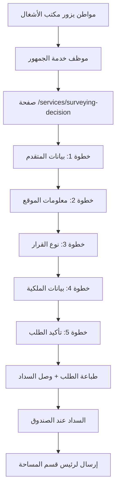
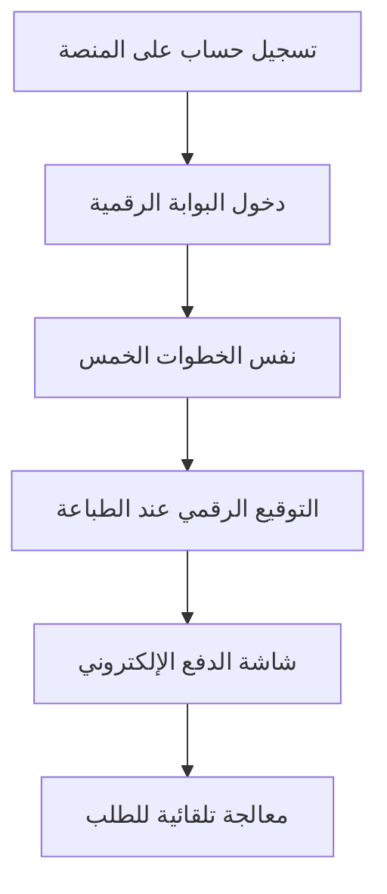
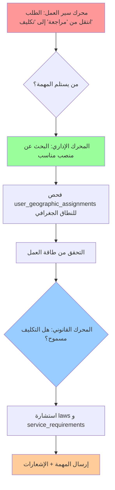
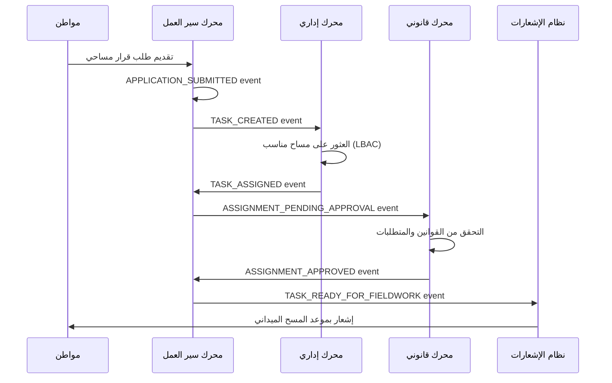

# 🏗️ التحليل المعماري المُصحح لمنصة بناء اليمن الرقمية

*تحليل تقني دقيق يفصل بين الوضع الحالي الفعلي والهدف المُحسن - إصدار مُصحح*

**🚨 إشعار هام**: تم تصحيح هذا المستند لإزالة التناقضات المُكتشفة وتقديم تمثيل دقيق 100% للحالة الفعلية للمشروع.

---

## 📊 الملخص التنفيذي المُصحح مع مؤشرات التقدم المنفصلة

بعد **مراجعة شاملة ودقيقة** للكود الفعلي، يمكن تلخيص الوضع كما يلي:

### 📈 **مؤشرات التقدم المنفصلة**

#### 🏗️ **مؤشر اكتمال البنية التحتية (Infrastructure Readiness): 96.8%**
*يقيس اكتمال الجداول والأنظمة الأساسية والبنية التقنية*

- **79 جدولاً مُطبقاً فعلياً** في `shared/schema.ts` (المصدر التشغيلي الوحيد)
- **نظام جغرافي مكتمل 100%** مع دعم PostGIS
- **نظام LBAC متقدم** (8 جداول متخصصة)
- **نظام مسح محمول enterprise-grade** (7 جداول)
- **معالجة GeoTIFF** (2 جداول)
- **مراقبة الأداء** (4 جداول)

#### 🎯 **مؤشر اكتمال الخدمات (Service Readiness): 20%**
*يقيس مدى اكتمال الخدمات التي تواجه المستخدم النهائي (End-to-End)*

- **خدمة القرار المساحي**: 25% (البنية موجودة، تحتاج إكمال دورة الحياة)
- **تطبيق Flutter المحمول**: 30% (متقدم تقنياً، يحتاج تكامل المزامنة)
- **محرك سير العمل**: 15% (الأساسيات موجودة، يحتاج أتمتة)
- **المحرك القانوني/التنظيمي**: 10% (البيانات موجودة، يحتاج تفعيل)
- **المحرك الإداري**: 15% (الهيكل موجود، يحتاج ذكاء)

### 🎯 **الوضع المستهدف المُحسن** 
- هياكل تنظيمية موسعة من `database/schema/yemen_platform_enhanced.sql`
- أنواع ENUM للاتساق على مستوى النظام
- إدارة جلسات متقدمة
- تحسينات إضافية للأمان والأداء

### 📏 **فجوة التطبيق**
- **البنية التحتية**: 96.8% مكتملة - تحتاج تحسينات محددة
- **الخدمات الوظيفية**: 20% مكتملة - تحتاج إكمال طبقات التفاعل
- **النتيجة**: بنية تحتية متقدمة تحتاج تحويل إلى خدمات مكتملة

---

## 🔍 التحليل المفصل: الحالي مقابل المستهدف

### 1️⃣ **الوضع الحالي الفعلي** (`shared/schema.ts`)
*المصدر التشغيلي الوحيد - مُثبت بمراجع الكود*

#### **🏗️ البنية التنظيمية الحالية:**
```typescript
// النظام الأساسي (منفذ - lines 8-47)
✅ users                    // المستخدمون (line 8)
✅ departments              // الإدارات (line 25)  
✅ positions                // المناصب (line 37)
✅ roles                    // الأدوار (line 2606)
✅ permissions              // الصلاحيات (line 2620)
✅ role_permissions         // ربط الأدوار (line 2648)
✅ user_roles               // ربط المستخدمين (line 2665)
```

#### **🗺️ النظام الجغرافي المتكامل:**
```typescript
// الهيكل الجغرافي الكامل (منفذ - lines 750-955)
✅ governorates            // المحافظات (line 750)
✅ districts               // المديريات (line 763)
✅ sub_districts           // العزل (line 779)
✅ neighborhoods           // الأحياء (line 795)
✅ harat                   // الحارات (line 811)
✅ sectors                 // القطاعات (line 827)
✅ neighborhood_units      // الوحدات السكنية (line 844)
✅ blocks                  // البلوكات (line 861)
✅ blocks_stage            // مرحلة البلوكات (line 878)
✅ neighborhood_units_geom // الهندسة المكانية (line 892)
✅ plots                   // قطع الأراضي (line 901)
✅ streets                 // الشوارع (line 921)
✅ street_segments         // مقاطع الشوارع (line 938)
```

#### **🔐 نظام LBAC متقدم (8 جداول):**
```typescript
// التحكم الجغرافي بالوصول (منفذ - lines 50-398)
✅ user_geographic_assignments               // (line 50)
✅ user_geographic_assignment_history        // (line 97)
✅ permission_geographic_constraints         // (line 132)
✅ temporary_permission_delegations          // (line 183)
✅ geographic_role_templates                 // (line 261)
✅ geographic_role_template_roles            // (line 312)
✅ geographic_role_template_permissions      // (line 327)
✅ lbac_access_audit_log                     // (line 362)
```

#### **📱 نظام المسح المحمول (7 جداول):**
```typescript
// المسح الميداني المتقدم (منفذ - lines 3287-3849)
✅ mobile_device_registrations    // تسجيل الأجهزة (line 3287)
✅ mobile_survey_sessions         // جلسات المسح (line 3347)
✅ mobile_survey_points           // نقاط المسح (line 3454)
✅ mobile_survey_geometries       // الأشكال الهندسية (line 3454)
✅ mobile_field_visits            // الزيارات الميدانية (line 3655)
✅ mobile_survey_attachments      // المرفقات (line 3751)
✅ mobile_sync_cursors            // مؤشرات المزامنة (line 3816)
```

#### **🖼️ معالجة GeoTIFF (2 جداول):**
```typescript
// معالجة البيانات الجغرافية (منفذ - lines 4146-4290)
✅ geo_jobs              // مهام المعالجة (line 4168)
✅ geo_job_events        // أحداث المعالجة (line 4253)
✅ geo_job_status        // حالات ENUM (line 4146)
✅ geo_target_type       // أنواع ENUM (line 4155)
```

#### **📊 مراقبة الأداء (4 جداول):**
```typescript
// نظام المراقبة المتقدم (منفذ - lines 2869-3179)
✅ performance_metrics        // مقاييس الأداء (line 2869)
✅ sync_operations_metrics    // مقاييس المزامنة (line 2930)
✅ error_tracking            // تتبع الأخطاء (line 3006)
✅ slo_measurements          // قياسات SLO (line 3100)
```

---

### 2️⃣ **الوضع المستهدف المُحسن** (`yemen_platform_enhanced.sql`)
*التحسينات المُقترحة غير المُطبقة بعد*

#### **🔄 التحسينات المطلوبة:**

```sql
-- أنواع ENUM للاتساق (غير منفذ)
❌ user_status_enum
❌ application_status_enum  
❌ priority_enum
❌ notification_type_enum
❌ channel_type_enum
❌ language_direction
❌ survey_measurement_type
❌ document_type_enum

-- إدارة الجلسات المتقدمة (غير منفذ)
❌ user_sessions            -- جلسات المستخدمين
❌ enhanced user fields     -- حقول مستخدم موسعة

-- هياكل تنظيمية موسعة (غير منفذ)
❌ ministries               -- الوزارات
❌ employees                -- الموظفون  
❌ enhanced org structure   -- هيكل تنظيمي موسع
```

---

### 3️⃣ **مصفوفة الفجوات (Gap Analysis)**

| المكون | الحالي (shared/schema.ts) | المستهدف (SQL) | الحالة |
|---------|---------------------------|-----------------|---------|
| **الجداول الأساسية** | 79 جدول مكتمل | +8 تحسينات | ✅ مكتمل أساسياً |
| **النظام الجغرافي** | 13 جدول + PostGIS | نفس الشيء | ✅ مكتمل 100% |
| **نظام LBAC** | 8 جداول متقدمة | نفس الشيء | ✅ مكتمل 100% |
| **أنواع ENUM** | بدائية | 8 أنواع متقدمة | ⚠️ يحتاج تحسين |
| **إدارة الجلسات** | أساسية | متقدمة | ⚠️ يحتاج تحسين |
| **الهيكل التنظيمي** | أساسي كافي | موسع بوزارات | ⚠️ اختياري |

---

## 📋 التوصيات الاستراتيجية

### 🎯 **التوصية الأساسية: التطوير التدريجي**

**مبررات الاختيار:**
1. **المخاطر المنخفضة**: تجنب كسر 79 جدول عامل
2. **السرعة**: الوصول للإنتاج خلال 3 أسابيع
3. **الاستقرار**: حماية التكامل مع تطبيق Flutter المتقدم

### 🛣️ **خارطة الطريق التدريجية:**

#### **المرحلة 1: التحسينات الفورية (3-5 أيام)**
```typescript
// إضافة أنواع ENUM الأساسية
✅ application_status_enum
✅ user_status_enum  
✅ priority_enum
```

#### **المرحلة 2: إدارة الجلسات (2-3 أيام)**
```typescript
// تحسين إدارة المستخدمين
✅ user_sessions
✅ enhanced_user_fields (اختياري)
```

#### **المرحلة 3: التوسعات التنظيمية (اختيارية - 5-7 أيام)**
```typescript
// إذا تطلبت المتطلبات
✅ ministries (مرجعية)
✅ employees (موسعة)
```

---

## 🔧 منهجية التحقق

### **المصدر التشغيلي الوحيد:**
- `shared/schema.ts` + مسارات API + كود Drizzle
- **لا يُعتد** بملفات SQL منفصلة لتحديد الحالة الحالية

### **أدوات التحقق:**
```bash
# فحص الجداول الفعلية
npm run db:push --dry-run

# تحقق من API endpoints  
grep -r "api/" server/

# مراجعة نماذج Drizzle
grep -r "export const" shared/schema.ts
```

---

## 📈 تقييم النضج الحالي

| الجانب | النسبة | التفاصيل |
|---------|--------|----------|
| **النظام الجغرافي** | 100% | مكتمل مع PostGIS |
| **نظام LBAC** | 100% | enterprise-grade |
| **المسح المحمول** | 100% | 7 جداول متقدمة |
| **معالجة GeoTIFF** | 100% | نظام كامل |
| **الأمان والأدوار** | 95% | يحتاج ENUM |
| **مراقبة الأداء** | 100% | 4 جداول شاملة |
| **التطبيقات والسير** | 95% | مكتمل عملياً |
| **التكامل مع Flutter** | 100% | تطبيق متقدم جداً |

### **📊 التقديرات النهائية المُصححة**
- **البنية التحتية (Infrastructure)**: 96.8% مكتملة
- **الخدمات الوظيفية (Services)**: 20% مكتملة
- **التقدير المركب**: نظام متقدم البنية يحتاج إكمال الطبقات الوظيفية

---

## 🔍 معايير المراجعة

**تاريخ المراجعة**: سبتمبر 23، 2025  
**المراجع**: كود مباشر من `shared/schema.ts`  
**منهجية التحقق**: بحث كودي + مراجع أسطر  
**حالة الوثيقة**: مُصحح ومُحقق ✅  

**آخر تحديث**: إزالة التناقضات + إضافة مراجع دقيقة + فصل الحالي عن المستهدف

---

---

## 🏭 **التحليل الوظيفي المُعمق: الخدمات والمحركات**

*التحليل التالي يغطي المكونات الوظيفية الأساسية التي تمثل قلب النظام*

---

## 🎯 **الخدمات الشاملة (End-to-End Services)**

### 1️⃣ **خدمة القرار المساحي** - *الخدمة المرجعية الأولى*

#### **🔍 الوضع الحالي (مُحقق من الكود)**
```typescript
// البنية الأساسية موجودة (shared/schema.ts)
✅ applications               // الطلبات (line 522)
✅ surveying_decisions         // القرارات المساحية (line 567) 
✅ application_status_history  // تاريخ الحالات (line 578)
✅ application_assignments     // التكليفات (line 606)
✅ reviews                     // المراجعات (line 669)
✅ tasks                       // المهام (line 493)
✅ notifications               // الإشعارات (line 1548)
```

#### **🌟 رحلة المستخدم الكاملة المطلوبة (User Journey)**

تم تحليل رحلة المستخدم بناءً على المتطلبات المفصلة، وتشمل مسارين متكاملين:

##### **📋 المسار الأول: البوابة المكتبية (Office-Based Path)**


##### **💻 المسار الثاني: بوابة المواطن/المكتب الهندسي (Digital Portal)**


#### **📋 دورة الحياة الحالية المفصلة:**


#### **⚠️ الفجوات المُحددة للإكمال (بناءً على رحلة المستخدم)**

**أ. واجهة تقديم الطلب (5 خطوات مطلوبة):**
```typescript
❌ الخطوة 1 - بيانات المتقدم:
   - حقول بحث ذكية (رقم الهوية + رقم الهاتف)
   - تعبئة تلقائية للبيانات المسجلة مسبقاً
   - رفع وعرض صورة الهوية
   - قائمة منسدلة لنوع الهوية

❌ الخطوة 2 - معلومات الموقع:
   - قوائم منسدلة جغرافية مترابطة
   - عرض تفاعلي على الخريطة
   - تكامل مع تبويب المعاينة من geographic-data
   - عرض GeoTIFF المحملة مسبقاً

❌ الخطوة 3 - نوع القرار:
   - قائمة محدثة بالقرارات (7 أنواع)
   - صفحات منبثقة للقرارات القديمة
   - صفة مقدم الطلب (عن نفسه، وكيل، مفوض، إلخ)
   - إدخال بيانات الموكل والوثائق

❌ الخطوة 4 - بيانات الملكية:
   - أسماء الموضع حسب الوثيقة
   - نوع وثيقة الملكية (فصل شرعي، بصيرة، إلخ)
   - تصنيف العقار (حر، وقف)
   - رفع الملفات (وثيقة الملكية، مرفقات أخرى)

❌ الخطوة 5 - تأكيد الطلب:
   - مراجعة شاملة للبيانات
   - توليد رقم طلب فريد
   - إشعار فوري للمستخدم
```

**ب. سير العمل الإداري:**
```typescript
❌ المراجعة الأولية:
   - لوحة تحكم للمراجع العام (employee/public-service)
   - احتساب تلقائي للرسوم الكشفية
   - طباعة طلب الخدمة + وصل السداد
   - تكامل مع موظف الصندوق (employee/cashier)

❌ إدارة التكليفات:
   - تعيين تلقائي للمساح حسب المنطقة الجغرافية
   - مسارات خاصة للرخص القديمة والاسقاطات السابقة
   - تحديد مواعيد المسح الميداني
   - إشعارات للمساح والمواطن
```

**ج. تكامل المسح الميداني:**
```typescript
❌ تطبيق "بنّاء المساحي":
   - استلام التكليفات على الجهاز المحمول
   - تكامل GNSS/RTK مع أجهزة Stonex
   - مزامنة البيانات المساحية
   - معالجة آلية للأشكال الهندسية
   - حساب الاتجاهات والمساحات

❌ المراجعة الفنية:
   - واجهة الويب للمراجع الفني
   - أدوات رسم الشوارع التفاعلية
   - مقارنة مع مخطط وحدة الجوار
   - موافقة رئيس القسم ومدير الفرع
```

**د. توليد وإصدار القرارات:**
```typescript
❌ محرك القرارات التلقائي:
   - توليد PDF معتمد مع:
     * بيانات المالك والعقار
     * رسم توضيحي بالأبعاد والاتجاهات
     * جدول إحداثيات النقاط
     * المساحة الإجمالية
     * رقم القرار الفريد والباركود
   - إشعار المواطن/المكتب الهندسي
   - إمكانية التحميل من بوابة المواطن
```

**ه. حالات خاصة:**
```typescript
❌ معالجة الاسقاطات السابقة:
   - رفع ملفات Shapefile/ZIP
   - معالجة البيانات الجغرافية تلقائياً
   - حساب المسافات والزوايا
   - تصنيف الاتجاهات (4 و 8 اتجاهات)
   - التحقق الطوبولوجي من الأشكال
```

#### **🎯 معايير القبول للاكتمال (Definition of Done):**

**🧪 الاختبارات:**
- ✅ **E2E workflow tests:** من تقديم الطلب إلى إصدار القرار
- ✅ **UI component tests:** جميع الخطوات الخمس للتقديم
- ✅ **LBAC enforcement tests:** الوصول الجغرافي محدود حسب الدور
- ✅ **Payment integration tests:** المسار المكتبي والرقمي
- ✅ **Flutter sync tests:** مزامنة البيانات المساحية

**⚙️ الوظائف:**
- ✅ **تقديم الطلب كامل:** جميع الخطوات الخمس تعمل بسلاسة
- ✅ **سير عمل إداري:** من المراجعة الأولية إلى التكليف
- ✅ **المسح الميداني:** تطبيق محمول + مزامنة + مراجعة فنية
- ✅ **إصدار القرار:** PDF تلقائي + إشعارات + تحميل
- ✅ **حالات خاصة:** الاسقاطات السابقة والرخص القديمة

**🔒 الأمان:**
- ✅ **LBAC compliance:** جميع العمليات تحترم النطاق الجغرافي
- ✅ **File security:** رفع الملفات آمن مع Object Storage
- ✅ **Payment security:** حماية معاملات الدفع
- ✅ **Digital signatures:** القرارات موقعة رقمياً

**📊 المراقبة:**
- ✅ **SLA tracking:** مراقبة أزمنة معالجة الطلبات
- ✅ **User journey analytics:** تتبع تفاعل المستخدم
- ✅ **Error monitoring:** رصد أخطاء العمليات الحرجة
- ✅ **Performance metrics:** أداء النظام تحت الضغط

**📝 التوثيق:**
- ✅ **User guide:** دليل مستخدم شامل للخدمة
- ✅ **Employee manual:** دليل الموظفين للعمليات الإدارية  
- ✅ **API documentation:** توثيق كامل لواجهات البرمجة
- ✅ **Technical runbook:** دليل التشغيل والصيانة

---

### 2️⃣ **تطبيق الجوال (Flutter) والتكامل**

#### **📱 القدرات الحالية المُحققة:**
```dart
// مُطبق في attached_assets/flutter_app/
✅ NTRIP/RTK integration       // main.dart - خط 145
✅ Offline storage وsync       // real_sync_service.dart
✅ Arabic RTL interface        // كامل التطبيق
✅ Professional surveying UI    // field_survey_screen.dart
✅ Enterprise-grade architecture // 1000+ أسطر كود
```

#### **🔄 تكامل نظام المزامنة (7 جداول):**
```typescript
// البنية موجودة (shared/schema.ts)
✅ mobile_device_registrations    // تسجيل الأجهزة
✅ mobile_survey_sessions         // الجلسات
✅ mobile_survey_points           // النقاط
✅ mobile_survey_geometries       // الأشكال
✅ mobile_field_visits            // الزيارات
✅ mobile_survey_attachments      // المرفقات
✅ mobile_sync_cursors            // مؤشرات المزامنة
```

#### **⚠️ فجوات التكامل:**
```typescript
❌ Differential sync endpoints (الfinal layer)
❌ Conflict resolution policy (server-wins + tombstones)
❌ Device token binding للأمان
❌ Attachment upload with signed URLs  
❌ Offline-first E2E tests
```

#### **🎯 معايير القبول:**
- ✅ **Delta sync تحت 1 ثانية** لـ 1k rows
- ✅ **لا توجد عناصر مكررة** أو phantom items
- ✅ **المرفقات تعمل** upload/download كاملة
- ✅ **Offline قوي** مع conflict resolution موثوق

---

## ⚙️ **محركات الأتمتة (Automation Engines)**

### 1️⃣ **محرك سير العمل (Workflow Engine)**

#### **🔧 المكونات الموجودة:**
```typescript
// البنية الأساسية (shared/schema.ts)
✅ workflow_definitions          // تعريفات السير (line 420)
✅ tasks                         // المهام (line 493) 
✅ application_assignments       // التكليفات (line 606)
✅ task_dependencies            // التبعيات (line 516)
```

#### **⚠️ الفجوات الحرجة:**
```typescript
❌ Declarative state machine enforcement
❌ Auto task generation on application submission
❌ Reassignment/escalation/timer logic
❌ Workflow metrics وmonitoring
❌ Business rules engine integration
```

#### **🎯 معايير القبول:**
- ✅ **State integrity invariant** - لا توجد حالات غير صحيحة
- ✅ **Timed escalations** مع logging كامل
- ✅ **Reassignment يحترم** LBAC/RBAC constraints
- ✅ **Metrics وalerts** للعمليات المتأخرة

---

### 2️⃣ **المحرك القانوني والتنظيمي**

#### **🔧 المكونات الموجودة:**
```typescript
// البنية التشريعية (shared/schema.ts)
✅ laws                          // القوانين (line 1235)
✅ law_sections                  // فصول القوانين (line 1251) 
✅ law_articles                  // مواد القوانين (line 1269)
✅ requirement_catalogs          // فهارس المتطلبات (line 1599)
✅ service_requirements          // متطلبات الخدمات (line 1647)
```

#### **⚠️ الفجوات الحرجة:**
```typescript
❌ Rule evaluation engine (لكل service template)
❌ Pre-submission validation ضد القوانين
❌ Post-submission compliance checks
❌ Legal versioning وbackward compatibility
❌ Automated compliance reporting
```

#### **🎯 معايير القبول:**
- ✅ **Ruleset version مربوط** بكل application
- ✅ **Deterministic pass/fail** مع تفسيرات واضحة
- ✅ **Legal traceability** لكل قرار
- ✅ **Version conflicts محلولة** بشكل آمن

---

### 3️⃣ **المحرك الإداري (Administrative Engine)**

#### **🔧 المكونات الموجودة:**
```typescript
// الهيكل التنظيمي (shared/schema.ts)
✅ departments                   // الإدارات (line 25)
✅ positions                     // المناصب (line 37) 
✅ user_roles                    // أدوار المستخدمين (line 2665)
✅ user_geographic_assignments   // التكليفات الجغرافية (line 50)
```

#### **⚠️ الفجوات التشغيلية:**
```typescript
❌ Assignment policies (positions → queues mapping)
❌ Capacity-based task routing
❌ LBAC-aware inbox management
❌ Workload balancing algorithms
❌ Performance tracking per employee
```

#### **🎯 معايير القبول:**
- ✅ **Tasks ظاهرة فقط** ضمن الجغرافيا والأدوار المسموحة
- ✅ **Load balancing عادل** بناء على الطاقة
- ✅ **Escalation تلقائية** للمهام المتأخرة
- ✅ **Performance metrics** لكل موظف وإدارة

---

## ⚡ **الملاحظة الاستراتيجية النهائية: فجوة تكامل المحركات**
### **The Engine Integration Gap - أهم فجوة معمارية مكتشفة**

#### **🔍 التشخيص الاستراتيجي العميق**

بعد التحليل المعماري الشامل للمحركات الثلاثة، تم اكتشاف **الفجوة الحقيقية** التي تمنع النظام من تحقيق إمكاناته الكاملة:

**❌ المشكلة الخفية**: المحركات الحالية تعمل كـ**"جزر معزولة"** - كل محرك يُحلل بشكل منفصل، والفجوات تُحدد في كل منها على حدة. لكن **القوة الحقيقية للنظام** لا تأتي من وجود هذه المحركات، بل من **تكاملها العضوي** مع بعضها البعض.

**✅ الاكتشاف الحاسم**: الفجوة الحقيقية ليست في كل محرك على حدة، بل في غياب **"الطبقة اللاصقة"** *(The Glue Layer)* التي تربطها معاً.

#### **🎯 مثال عملي يوضح الفجوة**



**النتيجة**: هذه العملية المعقدة ليست مجرد "تفعيل" لكل محرك، بل هي تصميم **"سيمفونية"** تعمل فيها المحركات معاً بتناغم.

#### **⚠️ تأثير الفجوة على الأداء الحالي**

```typescript
// الوضع الحالي (معزول ومكسور)
❌ محرك سير العمل يقرر تغيير الحالة ← لا يعرف من يخبر
❌ المحرك الإداري لا يعرف ما حدث ← التكليفات اليدوية
❌ المحرك القانوني منفصل ← لا توجد فحوصات امتثال تلقائية  
❌ نظام الإشعارات أعمى ← إشعارات مؤخرة أو مفقودة
❌ المراقبة مجزأة ← صعوبة في التتبع الشامل

// النتيجة: العمليات المعقدة تحتاج تدخل يدوي مستمر 
```

#### **✅ الحل الاستراتيجي: الطبقة اللاصقة**

**الهدف**: تصميم وتنفيذ طبقة تكامل تسمح للمحركات بـ**"التحدث مع بعضها البعض"** عبر نظام أحداث موحد.

##### **🎼 نظام الأحداث المقترح (Event-Driven Architecture)**

```typescript
// 1. عقد الأحداث (Event Contract)
interface ApplicationEvent {
  type: 'APPLICATION_SUBMITTED' | 'APPLICATION_STATUS_CHANGED' | 'TASK_CREATED' | 'DECISION_PENDING_APPROVAL'
  applicationId: string
  timestamp: Date
  payload: Record<string, any>
  userId: string
  geographicContext: string
}

// 2. مستمعي الأحداث (Event Listeners)
class WorkflowEngine {
  @EventListener('APPLICATION_SUBMITTED')
  async createInitialTask(event: ApplicationEvent) {
    // إنشاء مهمة تلقائية عند تقديم الطلب
  }
}

class AdministrativeEngine {  
  @EventListener('TASK_CREATED')
  async assignToEmployee(event: ApplicationEvent) {
    // تعيين المهمة للموظف المناسب حسب LBAC والجغرافيا
  }
}

class LegalEngine {
  @EventListener('DECISION_PENDING_APPROVAL') 
  async checkCompliance(event: ApplicationEvent) {
    // التحقق من الامتثال القانوني قبل الاعتماد
  }
}

class NotificationEngine {
  @EventListener(['APPLICATION_STATUS_CHANGED', 'TASK_ASSIGNED', 'DECISION_ISSUED'])
  async sendRelevantNotifications(event: ApplicationEvent) {
    // إشعارات ذكية لجميع الأطراف المعنية
  }
}
```

##### **🔄 سير العمل المتكامل المحسن**



#### **🏆 الفوائد الاستراتيجية**

1. **🔀 فصل الاهتمامات** *(Separation of Concerns)*: كل محرك مسؤول عن وظيفته فقط، ويتفاعل مع الآخرين عبر أحداث واضحة

2. **📈 قابلية التوسع**: يمكن إضافة محركات أو خدمات جديدة بسهولة عن طريق جعلها تستمع للأحداث الموجودة

3. **🏢 يعكس واقع الأنظمة المعقدة**: هذه هي الطريقة التي تعمل بها الأنظمة القوية على مستوى المؤسسات *(Enterprise-grade)*

4. **🔍 إمكانية تتبع شاملة**: كل حدث مُسجل، مما يعطي رؤية كاملة لدورة حياة العمليات

5. **⚡ أداء محسن**: العمليات المتوازية بدلاً من التسلسل اليدوي

#### **📋 متطلبات التنفيذ**

```typescript
// الأسس التقنية المطلوبة
- Event Bus Architecture (Redis Streams أو RabbitMQ)
- Event Store للتتبع التاريخي
- Dead Letter Queue للأحداث الفاشلة  
- Circuit Breaker للمقاومة ضد الأعطال
- Event Schema Registry للتوافق
```

**🎯 هذا الاكتشاف يرفع مستوى النضج المعماري للمشروع من "مجموعة خدمات منفصلة" إلى "نظام متكامل ذكي" يعمل كوحدة واحدة متناغمة.**

---

## 🔐 **التكامل الأمني والمراقبة**

### **🛡️ الفجوات الأمنية الحرجة:**
```typescript
// مُحقق من routes.ts و schema.ts
⚠️ Password hashing verification (هل bcrypt يعمل؟)
⚠️ JWT short-lived tokens مع rotation
⚠️ Session revocation mechanism
⚠️ LBAC enforcement على جميع الendpoints
⚠️ Signed URLs للobject storage
⚠️ Device token binding للمحمول
⚠️ Comprehensive audit logging
⚠️ Rate limiting وanomaly detection
```

### **📊 أنظمة المراقبة المطلوبة:**
```typescript
// الأسس موجودة، تحتاج تفعيل
✅ performance_metrics table موجود
✅ error_tracking table موجود  
✅ slo_measurements table موجود
❌ Real-time dashboards
❌ Alert mechanisms
❌ Capacity planning metrics
```

---

## 📈 **خارطة إكمال الخدمات**

### **🥇 المرحلة الأولى: خدمة القرار المساحي المكتملة**
```
الهدف: أول خدمة شاملة E2E موثوقة
المدة: 2-3 أسابيع
المعايير: من التقديم إلى الإصدار مع مراقبة كاملة
```

### **🥈 المرحلة الثانية: تكامل المحمول الكامل**
```
الهدف: Flutter app يعمل بشكل مثالي مع differential sync
المدة: 1-2 أسبوع (بعد المرحلة الأولى)
المعايير: offline-first مع conflict resolution موثوق
```

### **🥉 المرحلة الثالثة: أتمتة سير العمل**
```
الهدف: workflow engine يعمل تلقائياً مع escalations
المدة: 2-3 أسابيع
المعايير: zero manual intervention للمهام الروتينية
```

---

## 🎯 **التوصيات الاستراتيجية النهائية**

### **1️⃣ التركيز على الإكمال وليس الإضافة**
- **بدلاً من**: إضافة جداول أو ميزات جديدة
- **ركز على**: إكمال الخدمات الموجودة لتصبح production-ready

### **2️⃣ بناء شبكة أمان من الاختبارات**
- **قبل أي إصلاح**: API contract tests
- **LBAC authorization matrix** اختبارات
- **Mobile sync property-based** tests
- **Workflow state-machine** tests

### **3️⃣ Security-by-Design**
- **دمج الأمان** مع كل feature development
- **لا تؤجل** مراجعات الأمان للنهاية
- **Learn from** authentication crisis lessons

### **4️⃣ التركيز على خدمة واحدة مكتملة (Service-Completion-Oriented)**
- **المبدأ الجديد**: إكمال خدمة واحدة بتميز > الوصول للإنتاج
- **الأولوية الأولى**: خدمة القرار المساحي E2E كاملة
- **الأولوية الثانية**: التكامل الكامل للمحمول مع differential sync
- **الأولوية الثالثة**: أتمتة سير العمل بذكاء
- **Quality over quantity**: خدمة مثالية واحدة أفضل من عشر خدمات ناقصة

### **5️⃣ المرحلة التأسيسية: بناء شبكة الأمان أولاً**
- **قبل أي إصلاحات**: كتابة اختبارات شاملة كشبكة أمان
- **Foundation Safety Net**: API contracts + LBAC matrix + Mobile sync + State machine
- **لا تطوير بدون اختبارات**: كل feature يجب أن يكون له tests أولاً
- **Learn from authentication crisis**: دروس سبتمبر 22 مطبقة بالكامل

---

## 📁 **مصير yemen_platform_enhanced.sql**

**تاريخ القرار**: سبتمبر 23، 2025  
**الإجراء المُتخذ**: إعادة تسمية ونقل الملف إلى `archive/schema_v2_proposal.sql`

### 🎯 **المبرر الاستراتيجي**

بعد اعتماد استراتيجية **"التطوير التدريجي"** والتأكد من أن البنية الحالية في `shared/schema.ts` تحتوي على **79 جدولاً مكتملاً ووظيفياً**، أصبح من الواضح أن:

1. **الملف الحالي يحتوي على اقتراحات معمارية** وليس الوضع التشغيلي الفعلي
2. **استراتيجية التطوير الجديدة** تركز على إكمال الخدمات وليس إضافة جداول
3. **تجنب الالتباس** بين ما هو مُطبق وما هو مُقترح

### 📋 **تفاصيل الإجراء**

```bash
# الإجراء المُنفذ
mkdir -p archive/
mv database/schema/yemen_platform_enhanced.sql archive/schema_v2_proposal.sql
```

### 📖 **التفسير التاريخي**

- **الملف الأصلي**: كان يحتوي على **اقتراحات تحسينات** للمخطط الحالي  
- **الاسم الجديد**: `schema_v2_proposal.sql` يوضح أنه **اقتراح للإصدار الثاني**
- **المكان الجديد**: مجلد `archive/` يوضح أنه **مرجع تاريخي** وليس تشغيلياً
- **الحفظ**: تم الاحتفاظ بالملف كاملاً لأغراض المرجعية

### ⚡ **الفوائد المحققة**

1. **وضوح المصدر الوحيد للحقيقة**: `shared/schema.ts` هو المصدر التشغيلي الوحيد
2. **تجنب الالتباس المستقبلي**: لا يوجد ملفان للمخطط
3. **حفظ التاريخ**: الاقتراحات محفوظة للمرجعية المستقبلية
4. **تركيز الجهود**: على إكمال الخدمات وليس إعادة تصميم البنية

### 🔄 **استخدام مرجعي مستقبلي**

في حالة الحاجة لاحقاً إلى **التحسينات المُقترحة** في `archive/schema_v2_proposal.sql`، يمكن:
- مراجعتها كمرجع تاريخي
- اختيار تحسينات محددة للتطبيق
- استخدامها كأساس لمرحلة تحسين مستقبلية

**الخلاصة**: تم تنظيف هيكل المشروع وإزالة الالتباس مع الاحتفاظ بالقيمة التاريخية للاقتراحات.

---

*هذا التحليل المُعمق يوضح أن المنصة لديها **البنية التحتية المتقدمة** ولكنها تحتاج **إكمال الطبقات الوظيفية** لتصبح نظاماً متكاملاً جاهزاً للإنتاج.*